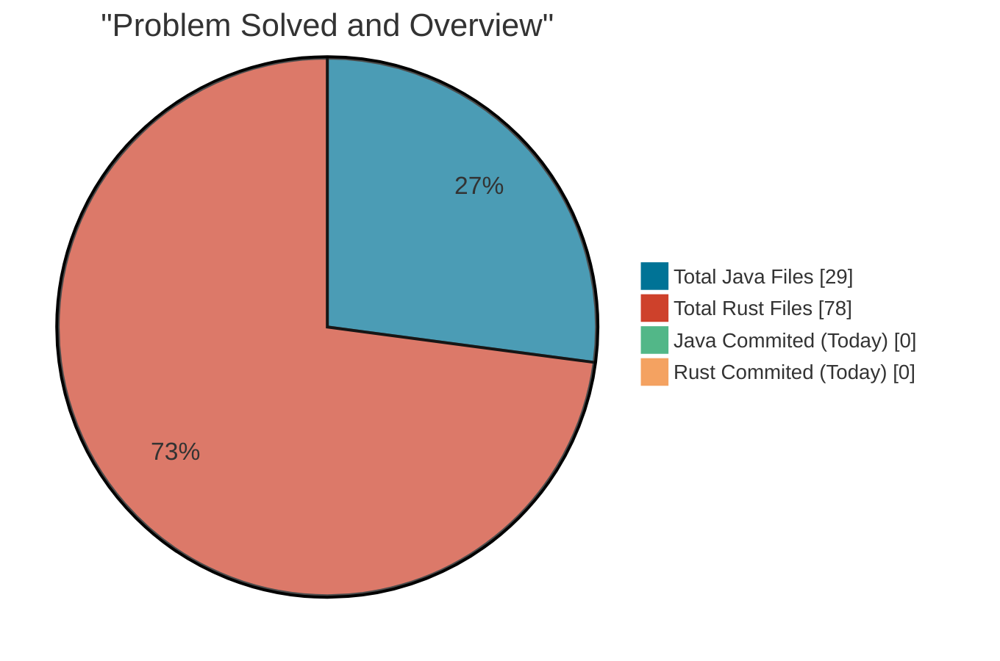

## 🚀 Overall Overview Of The Repo

### 📊 Codebase Distribution
This readme file will be updated automatically on every push event a workflow has been coded to update the readme file
The pie chart gives an instant visual on your file count.

# Total Files 107
Code snippet

----------

### 📋 Technical Breakdown

**Metric**

**☕ Java**

**🦀 Rust**

**Total Files**

29

78

**Today's Commits**

0

0

